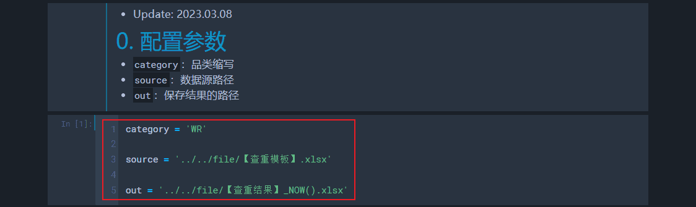
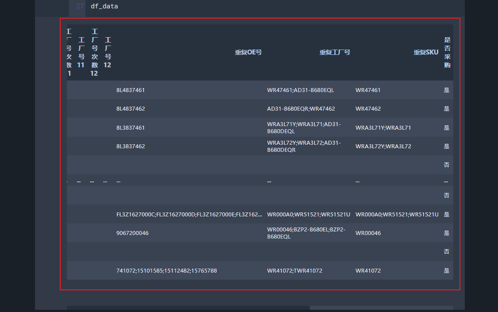

# 查重（Update: 2023.03.08）
## 0. 流程及注意事项
1. 其他注意事项：
    - 由于数据格式不统一，查重操作不能达到100%完美，需要根据经验不断更新迭代（尤其是正则表达式部分，建议该手动整理的手动搞，该放弃的直接pass）

## 1. 内部查重
1. 更改品类、把需要查重的文件和结果的保存路径按实际需要进行修改
    - 
2. 输出：`重复OE号`、`重复工厂号`、`重复SKU`和`是否采购`
    - 